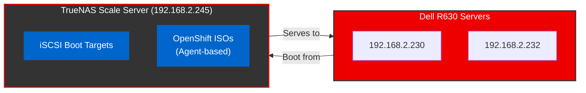
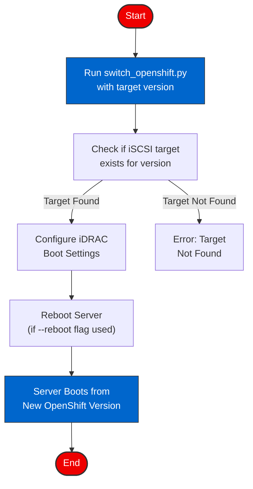
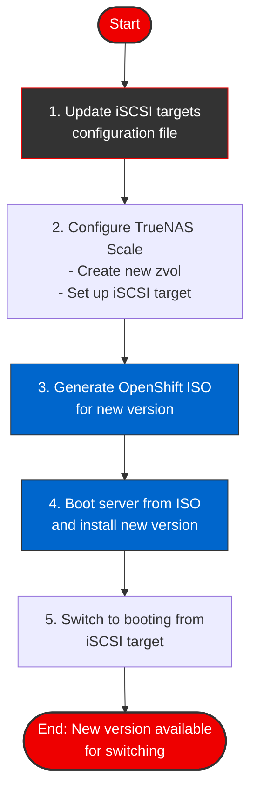

# Dell PowerEdge R630 OpenShift Multiboot System

<div align="center">
  
  
  <h1>Dell PowerEdge R630 OpenShift Multiboot System</h1>
</div>

This repository contains scripts and configuration files to enable multiboot capabilities for Dell PowerEdge R630 servers using TrueNAS Scale as the storage backend. The system allows for easy switching between different OpenShift versions and other operating systems.

## System Overview

The multiboot system leverages a combination of technologies:

1. **iSCSI Boot** - For booting from pre-configured OpenShift installations
2. **Agent-based ISO boot** - For fresh installations using OpenShift's agent-based installer
3. **TrueNAS Scale** - For centralized storage management



## Key Features

- **Multiple OpenShift Versions**: Store and boot from different OpenShift versions simultaneously
- **Quick Version Switching**: Switch between versions with a single command
- **Agent-based Installation**: Support for OpenShift 4.18's agent-based installer
- **Automated Configuration**: Scripts for automating TrueNAS setup and ISO generation
- **TrueNAS Auto-discovery**: Automatic detection of existing configuration and intelligent setup

## Components

### Configuration Files

- `config/iscsi_targets.json` - Definition of iSCSI targets for different OpenShift versions

### Scripts

- `scripts/switch_openshift.py` - Script to switch between OpenShift versions/boot methods
- `scripts/setup_truenas.sh` - Script to configure TrueNAS Scale for multiboot
- `scripts/generate_openshift_iso.py` - Script to generate and upload OpenShift agent-based ISOs
- `scripts/truenas_autodiscovery.py` - Automatically discover and configure TrueNAS Scale

### Documentation

This project includes comprehensive documentation to help users understand and use the system:

#### Main Documentation
- `README.md` - This overview document with getting started information
- `MULTIBOOT_IMPLEMENTATION.md` - Detailed implementation plan and architecture
- `NETBOOT_IMPLEMENTATION.md` - Details about network boot implementation
- `IMPLEMENTATION_SUMMARY.md` - Summary of all implementation details

#### Administrator Guides
- `docs_mkdocs/docs/ADMIN_HANDOFF.md` - Complete administrator handoff guide
- `docs_mkdocs/docs/TRUENAS_AUTHENTICATION.md` - Guide to TrueNAS authentication methods
- `docs_mkdocs/docs/TROUBLESHOOTING.md` - Solutions to common issues
- `docs_mkdocs/docs/SECRETS_PROVIDER.md` - Secrets management system documentation

#### Development & Operations
- `docs_mkdocs/docs/GITHUB_ACTIONS_USAGE.md` - CI/CD workflow documentation
- `docs_mkdocs/docs/OPENSHIFT_VALUES_SYSTEM.md` - Guide to OpenShift configuration
- `frontend/public/brand-assets/BRAND-ASSET-GUIDELINES.md` - Visual identity guidelines

## Quick Start Guide

## TrueNAS Authentication

For secure access to TrueNAS Scale, this project provides multiple authentication methods:

- **API Key Authentication** (recommended for automation)
- **Username/Password Authentication**
- **SSH Key Authentication** (for remote commands)

For detailed information on setting up and using these authentication methods, see [TRUENAS_AUTHENTICATION.md](docs_mkdocs/docs/TRUENAS_AUTHENTICATION.md).

### Secure Authentication Wrapper

We provide a convenient wrapper script that securely manages TrueNAS credentials:

```bash
# First-time setup (creates a secure configuration file)
./scripts/truenas_wrapper.sh

# Run autodiscovery with saved credentials
./scripts/truenas_wrapper.sh autodiscovery

# Run the setup script via SSH
./scripts/truenas_wrapper.sh setup
```

## Initial Setup

1. **Configure TrueNAS Scale**:
   
   **Option 1: Automated discovery and configuration with secure authentication**
   ```bash
   # Setup credentials and run autodiscovery
   ./scripts/truenas_wrapper.sh
   ```
   
   **Option 2: Direct configuration with command-line credentials**
   ```bash
   # Run discovery with explicit credentials
   ./scripts/truenas_autodiscovery.py --username root --host 192.168.2.245
   ```
   
   **Option 3: Manual configuration via SSH**
   ```bash
   # Run this script on the TrueNAS Scale server
   scp scripts/setup_truenas.sh root@192.168.2.245:/tmp/
   ssh root@192.168.2.245 "bash /tmp/setup_truenas.sh"
   ```

2. **Generate OpenShift ISO**:
   ```bash
   # Generate an OpenShift 4.18 agent-based ISO
   ./scripts/generate_openshift_iso.py --version 4.18 --rendezvous-ip 192.168.2.230
   ```

3. **Configure Dell R630 for boot**:
   ```bash
   # Configure the R630 server to boot from the ISO for fresh installation
   ./scripts/switch_openshift.py --server 192.168.2.230 --method iso --version 4.18 --reboot
   ```

### Switching Between Versions

Once you have multiple OpenShift versions installed, you can easily switch between them:

```bash
# Switch to OpenShift 4.18
./scripts/switch_openshift.py --server 192.168.2.230 --method iscsi --version 4.18 --reboot

# Switch to OpenShift 4.17
./scripts/switch_openshift.py --server 192.168.2.230 --method iscsi --version 4.17 --reboot
```

The switching process works as illustrated below:



## Adding a New OpenShift Version

The process for adding a new OpenShift version is illustrated below:



**Step-by-step instructions:**

1. **Update the iSCSI targets configuration** (already includes targets for 4.16-4.18)
2. **Configure TrueNAS Scale**:
   - Create a new zvol for the version
   - Set up a new iSCSI target
3. **Generate the ISO**:
   ```bash
   ./scripts/generate_openshift_iso.py --version <new_version> --rendezvous-ip 192.168.2.230
   ```
4. **Install the new version**:
   ```bash
   ./scripts/switch_openshift.py --server 192.168.2.230 --method iso --version <new_version> --reboot
   ```

## Detailed Documentation

For detailed implementation steps and procedures, refer to [MULTIBOOT_IMPLEMENTATION.md](MULTIBOOT_IMPLEMENTATION.md).

## Requirements

- Dell PowerEdge R630 servers (iDRAC configured)
- TrueNAS Scale server (192.168.2.245)
- Network connectivity between all components
- Python 3.6+ with required packages:
  ```bash
  pip install requests pathlib
  ```

## Maintenance Procedures

### TrueNAS Configuration Discovery and Analysis

```bash
# Using the secure wrapper script:
./scripts/truenas_wrapper.sh autodiscovery --discover-only
./scripts/truenas_wrapper.sh autodiscovery --apply

# Or using direct command with explicit credentials:
./scripts/truenas_autodiscovery.py --discover-only --host 192.168.2.245
./scripts/truenas_autodiscovery.py --discover-only --output truenas_config.json
./scripts/truenas_autodiscovery.py --apply --host 192.168.2.245
```

### Checking iSCSI Target Status

```bash
./scripts/switch_openshift.py --server 192.168.2.230 --method iscsi --version 4.18 --check-only
```

### Verifying ISO Availability

```bash
./scripts/switch_openshift.py --server 192.168.2.230 --method iso --version 4.18 --check-only
```

## Troubleshooting

For common issues and solutions, refer to the "Troubleshooting" section in [MULTIBOOT_IMPLEMENTATION.md](MULTIBOOT_IMPLEMENTATION.md).

## License

This project is licensed under the MIT License - see the LICENSE file for details.
