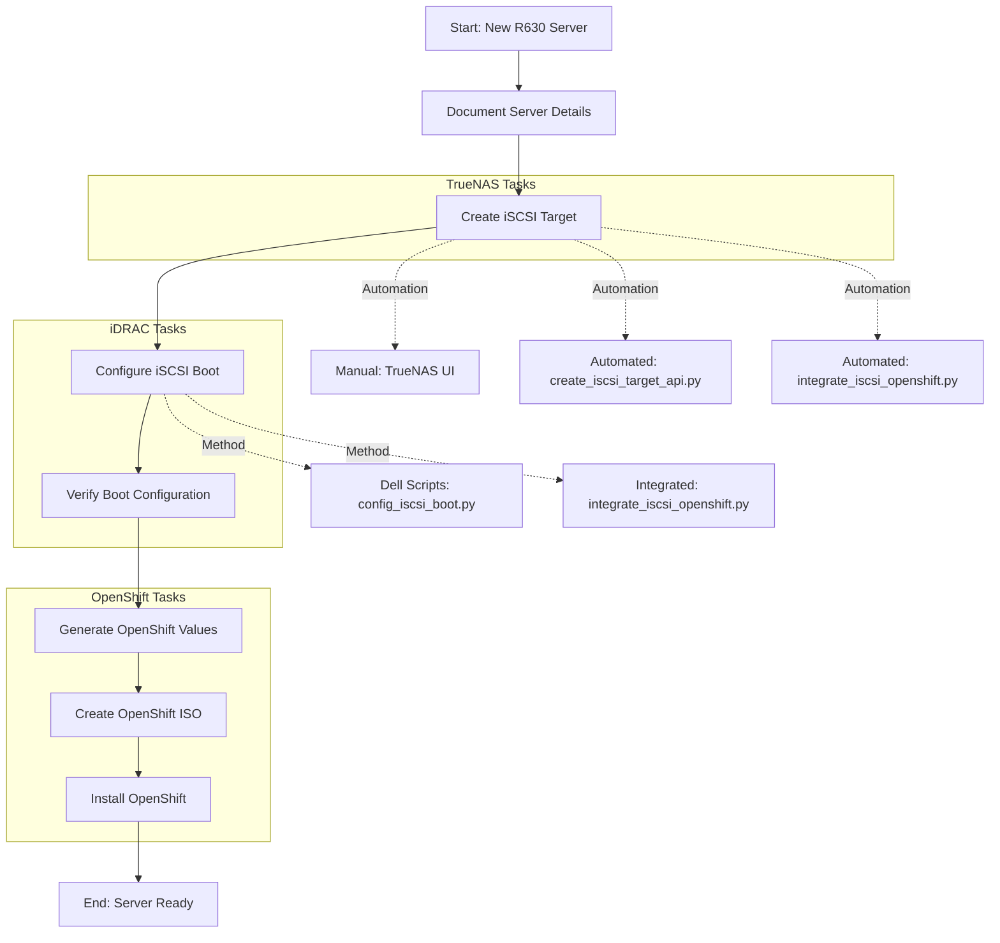
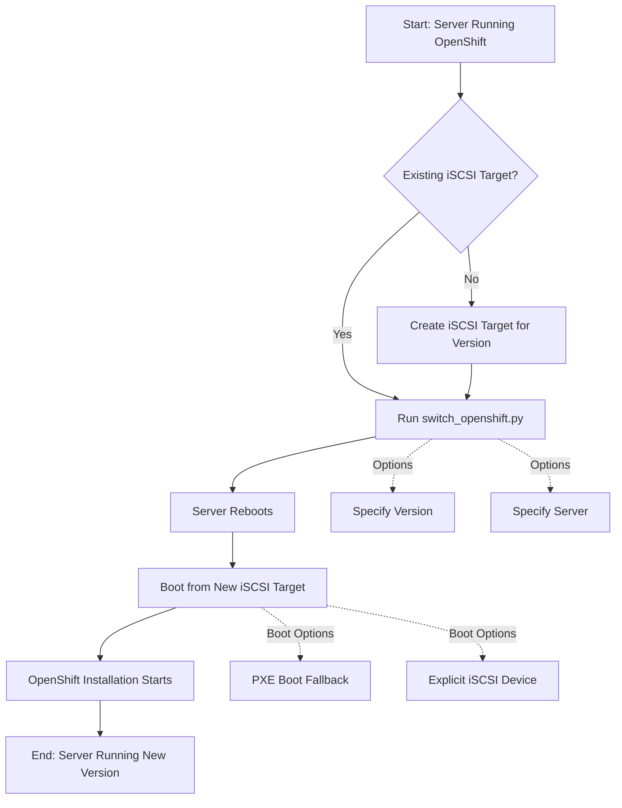
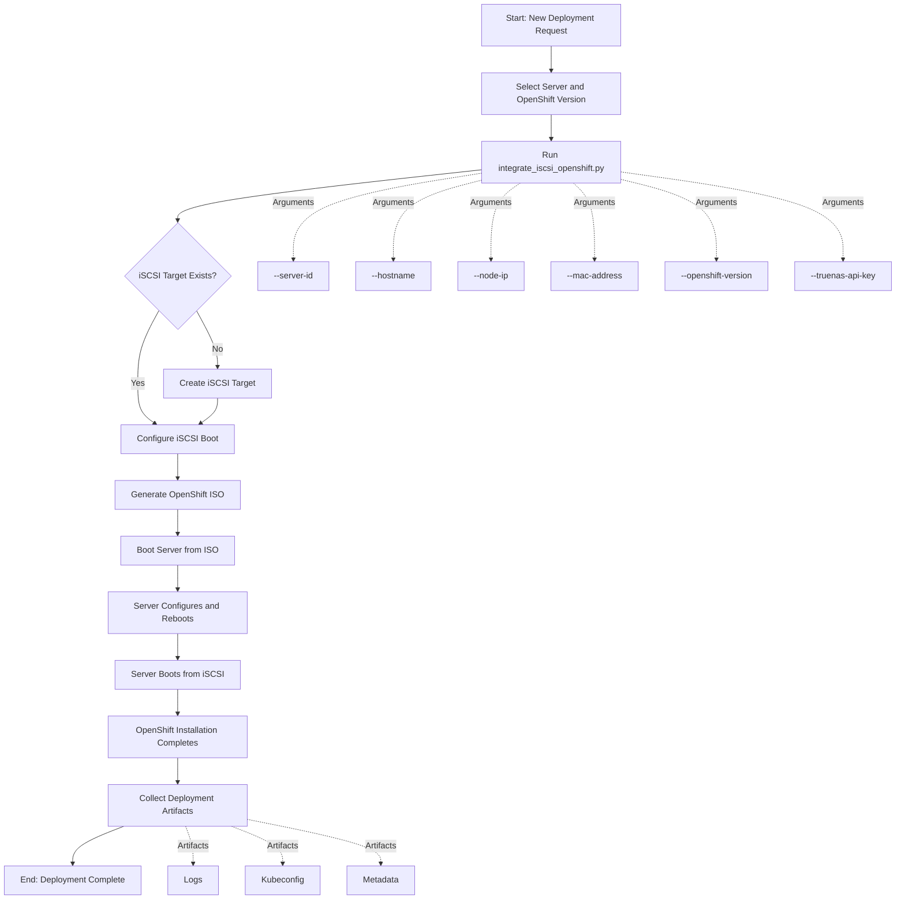
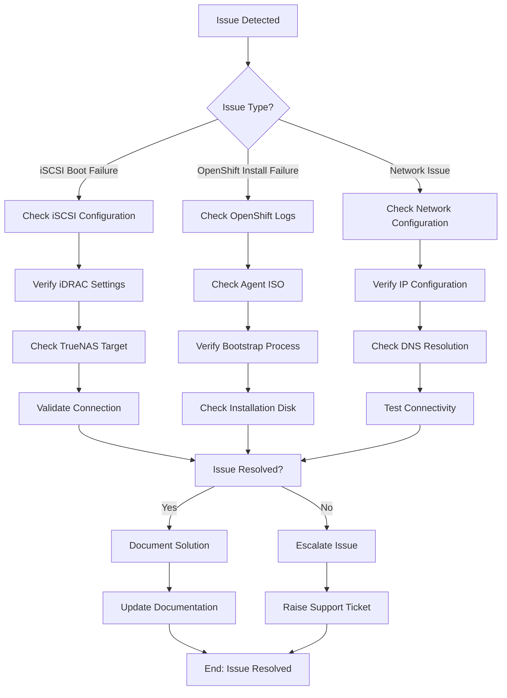
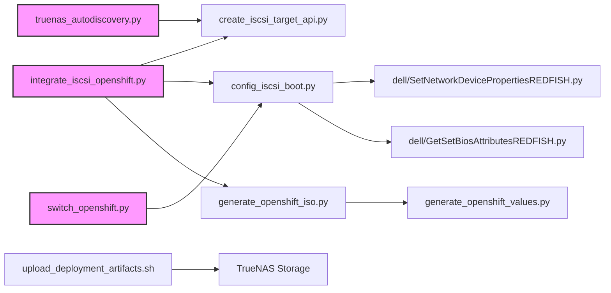

R630 iSCSI Switchbot Process Flows

This document provides comprehensive end-to-end process flows for common use cases in the R630 iSCSI Switchbot environment. Each process is presented with a diagram followed by detailed step-by-step instructions.

## Table of Contents

1. [Adding a New R630 Server](#adding-a-new-r630-server)
2. [Switching OpenShift Versions](#switching-openshift-versions)
3. [Full Deployment Workflow](#full-deployment-workflow)
4. [Troubleshooting Process](#troubleshooting-process)

## Adding a New R630 Server

This process covers how to set up a new Dell R630 server with iSCSI boot capabilities and prepare it for OpenShift deployment.



### Step-by-Step Process

1. **Document Server Details**
   - Add server to inventory in `docs/DEPLOYMENT_TRACKING.md`
   - Assign a server ID and unique hostname (e.g., "humpty" and "dumpty")
   - Record iDRAC IP, MAC address, and other relevant details

2. **Create iSCSI Target on TrueNAS**
   - Option 1: Use TrueNAS UI to manually create the target
   - Option 2: Use the API-based automation script
     ```bash
     ./scripts/create_iscsi_target_api.py --server-id XX --hostname NAME --api-key "YOUR_API_KEY"
     ```
   - Option 3: Use the integrated workflow
     ```bash
     python3 scripts/integrate_iscsi_openshift.py --server-id XX --hostname NAME --node-ip IP --mac-address MAC --truenas-api-key "YOUR_API_KEY"
     ```

3. **Configure iSCSI Boot on Server**
   - Configure the server's integrated NIC for iSCSI boot
     ```bash
     python3 scripts/config_iscsi_boot.py --server IP --nic NIC.Integrated.1-1-1 --target TARGET
     ```
   - Or use the integrated workflow (which calls this script internally)

4. **Verify Boot Configuration**
   - Verify iSCSI configuration on the server
     ```bash
     python3 scripts/config_iscsi_boot.py --server IP --validate-only
     ```
   - Reboot the server to apply pending configurations
   - Check that the server attempts to boot from iSCSI

5. **Generate OpenShift Values and ISO (Optional)**
   - Generate the OpenShift configuration values
   - Create an OpenShift agent-based installer ISO
   - This step is optional if you're just setting up the server for iSCSI boot

## Switching OpenShift Versions

This process covers how to switch a server between different OpenShift versions using the iSCSI boot capability.



### Step-by-Step Process

1. **Check Existing iSCSI Targets**
   - Verify if an iSCSI target already exists for the desired OpenShift version
   - List available targets:
     ```bash
     python3 scripts/config_iscsi_boot.py --list-targets
     ```

2. **Create Target if Needed**
   - If no target exists, create one for the desired version
   - See "Adding a New R630 Server" process

3. **Switch OpenShift Version**
   - Use the switch_openshift.py script to reconfigure the server
     ```bash
     python3 scripts/switch_openshift.py --server 192.168.2.230 --target openshift_4_18
     ```

4. **Monitor Boot Process**
   - The server will reboot automatically
   - Watch the POST screen to verify iSCSI boot
   - The server will boot from the new iSCSI target

5. **Verify New Version**
   - After boot completes, verify the OpenShift version
   - Check cluster version using `oc get clusterversion`

## Full Deployment Workflow

This diagram illustrates the complete end-to-end process for deploying OpenShift on an R630 server using iSCSI boot.



### Detailed Workflow

1. **Preparation**
   - Select the target server (e.g., humpty or dumpty)
   - Determine the OpenShift version to deploy
   - Ensure TrueNAS and the server are accessible

2. **Integrated Process**
   - Use the integrated workflow script
     ```bash
     python3 scripts/integrate_iscsi_openshift.py \
       --server-id 01 \
       --hostname humpty \
       --node-ip 192.168.2.230 \
       --mac-address XX:XX:XX:XX:XX:XX \
       --openshift-version 4.18 \
       --truenas-api-key "YOUR_API_KEY"
     ```

3. **Server Boot Sequence**
   - Boot the server from the generated ISO
   - The server will install OpenShift and reboot
   - After rebooting, it will boot from the iSCSI target
   - OpenShift will complete installation

4. **Artifact Collection**
   - Deployment artifacts are collected and stored on TrueNAS
   - Location: `/mnt/tank/deployment_artifacts/r630-XX/`
   - Contains: logs, kubeconfig, and metadata

## Troubleshooting Process

This flowchart guides through the process of troubleshooting common issues with the iSCSI boot and OpenShift deployment.



### Troubleshooting Steps

1. **iSCSI Boot Issues**
   - Verify target configuration in TrueNAS
   - Check iSCSI configuration on the server
     ```bash
     python3 scripts/config_iscsi_boot.py --server IP --validate-only
     ```
   - Ensure network connectivity between server and TrueNAS
   - Check if there are pending configuration jobs

2. **OpenShift Installation Issues**
   - Check installation logs on the ISO during bootstrap
   - Verify the correct device path is being used
   - Check if the server can access the required resources
   - Verify DNS, gateway, and network configuration

3. **Common Resolutions**
   - Reset iSCSI configuration and reconfigure
     ```bash
     python3 scripts/config_iscsi_boot.py --server IP --reset-iscsi
     ```
   - Recreate the OpenShift ISO with corrected parameters
   - Fix network configuration in the OpenShift values file

## Script Integration Map

This diagram visualizes how the various scripts in the system interact to provide the full functionality.



### Key Script Functions

- **integrate_iscsi_openshift.py**: Main integration script that orchestrates the end-to-end process
- **create_iscsi_target_api.py**: Configures TrueNAS with the necessary zvols and iSCSI targets using the API
- **config_iscsi_boot.py**: Configures iSCSI boot on Dell R630 servers
- **switch_openshift.py**: Switches servers between different OpenShift versions
- **truenas_autodiscovery.py**: Discovers TrueNAS resources using the API
- **generate_openshift_iso.py**: Generates OpenShift agent-based installation ISOs
